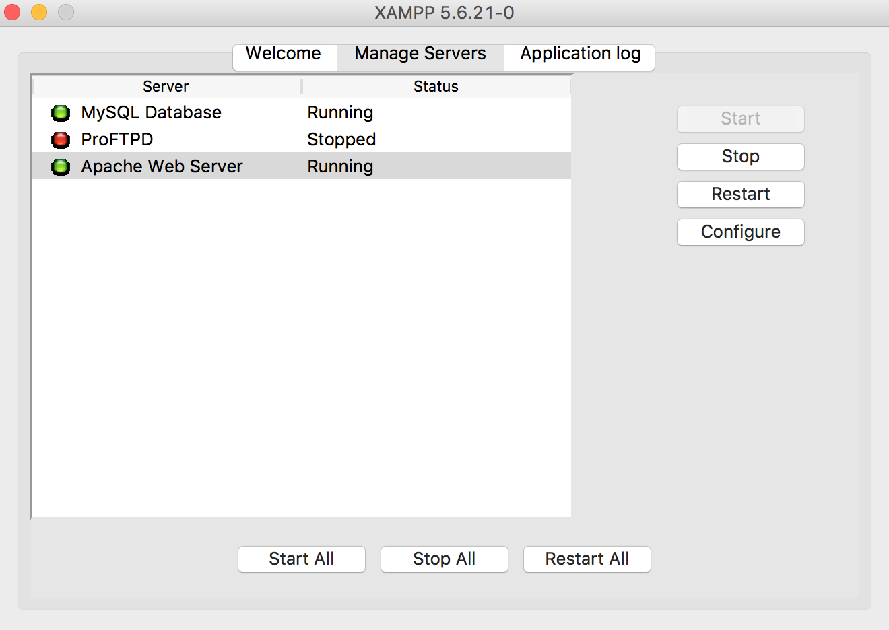
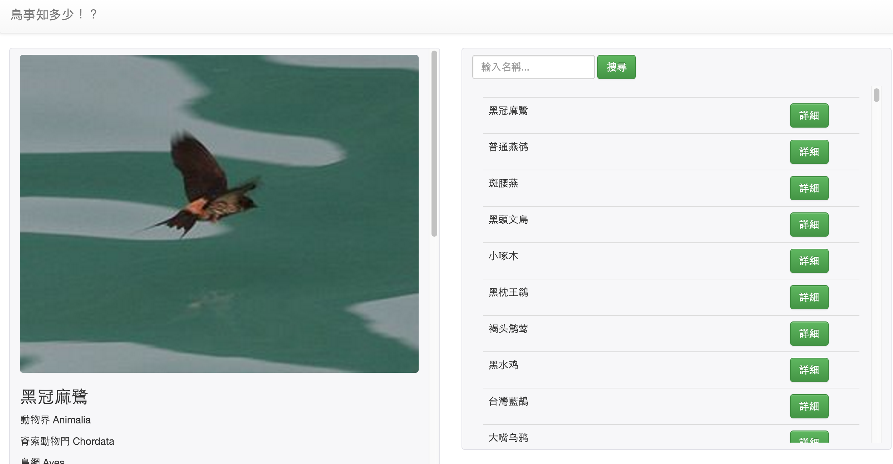

# 2016102930-tbn-hackathon-team10

## 主題：鳥事知多少！？

近期鳥類數量與種類受到大家的關注，其中相關[報導](http://www.appledaily.com.tw/realtimenews/article/life/20161027/976631/)指出過於的都市開發導致稀有鳥類大量滅絕。因此，本系統針對台灣地區鳥類提供相關知識與議題討論，其中包含：

* 各種鳥類近年來數量趨勢
* 環境對於鳥類的影響
* 鳥類滅絕時間預估

## 環境建置

### Node.js 安裝：
使用 `curl` 取得安裝檔案，並且透過 `apt-get install nodejs`安裝此套件。

```
curl -sL https://deb.nodesource.com/setup_4.x | sudo -E bash -

apt-get install nodejs
```

安裝完後，透過 `node --version` 命令查詢版本並確認安裝成功。

```
node --version

#v4.2.6  成功可以看到版本 
```

### APIs Server (express)：

將目錄移至 `/apis` 且使用下列語法安裝相依套件：

```
sudo npm install
```

最後，啟動 APIs Server。

```
sudo npm run start
```

### UI ：

首先，下載 [XAMPP](https://www.apachefriends.org/zh_tw/index.html) 並安裝。

安裝完成後，如下圖啟動 apache 與 MySQL ：



最後將 `/ui` 目錄移至 `/var/www/html` 內。


### 資料庫 ：

進入 MySQL 將 `/sql/` 內的兩個資料檔匯入資料庫中。


### 展示 ：

開啟瀏覽器輸入 `http://localhost` ，即可預覽本系統。




